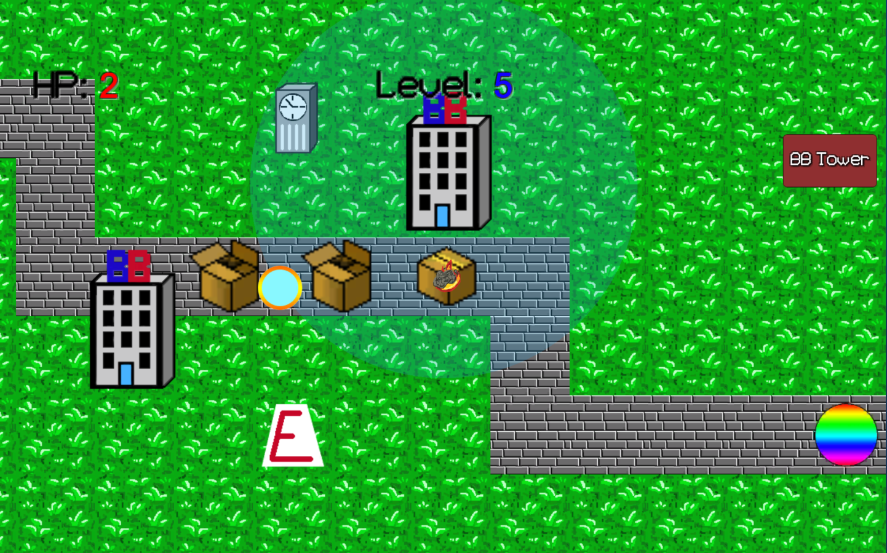

# BoxBlaster
BoxBlaster is a Unity tower defense game with the goal of defending your territory from box enemies by constructing BoxBlaster Towers.

## Game Screens
All sprites and animations were made using Adobe Photoshop.

## Next Steps
The next steps for BoxBlaster is implementing an in-game currency system and adding more elusive towers.
